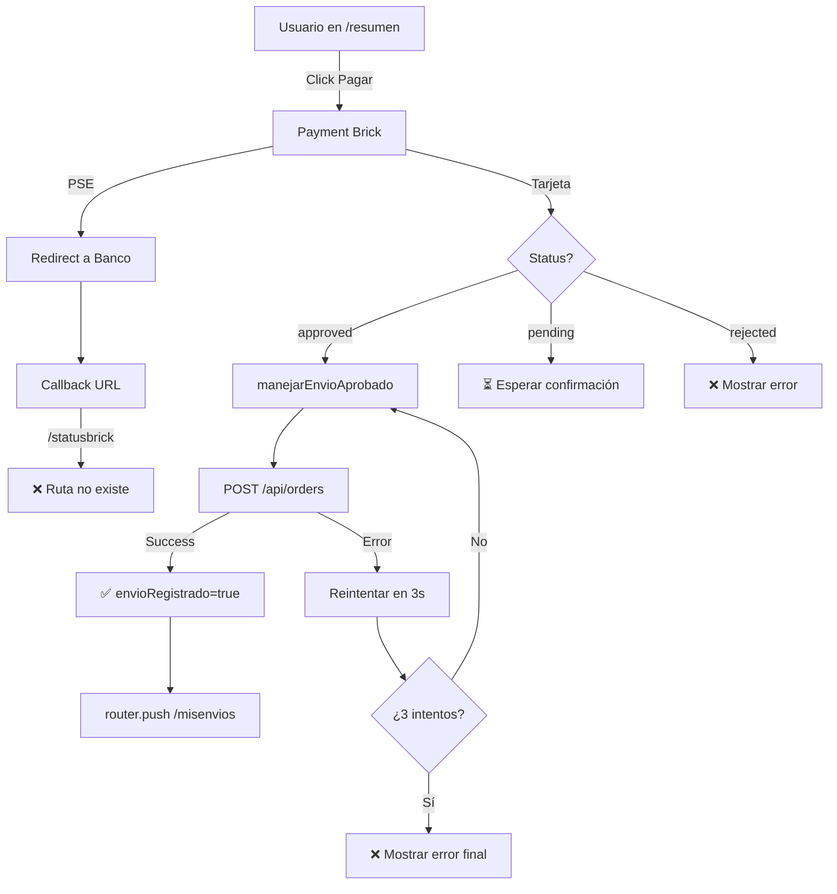

# 🔍 ANÁLISIS COMPLETO - Flujo MercadoPago y Redirecciones

**Fecha:** 2 de Noviembre, 2025  
**Objetivo:** Revisar flujo de pago y redirecciones después del pago exitoso

---

## ✅ ESTADO ACTUAL DEL FLUJO

### 📋 **Resumen Ejecutivo**

El flujo de MercadoPago está **CORRECTAMENTE IMPLEMENTADO** con múltiples protecciones anti-duplicación y manejo de diferentes métodos de pago.

---

## 🔄 FLUJO COMPLETO DE PAGO

### **1. Usuario en Resumen → Hace Click en "Pagar"**

```
📍 Ubicación: src/components/MercadoPago.js
```

**Qué sucede:**
1. Se inicializa el Payment Brick de MercadoPago
2. Se marca `origenPago = "payment_brick"` en sessionStorage
3. Usuario ingresa datos de tarjeta/PSE/Efecty

---

### **2. Usuario Completa el Pago**

```javascript
// Línea 394-510 en MercadoPago.js
onSubmit: async (formData) => {
  // ✅ Procesa el pago
  // ✅ Llama a /api/mercadopago/process-payment
  // ✅ Recibe respuesta con status: "approved", "pending", "rejected"
}
```

**Estados posibles:**
- ✅ **approved** → Pago exitoso inmediato
- ⏳ **in_process/pending** → Pago pendiente (PSE, Efecty)
- ❌ **rejected** → Pago rechazado

---

### **3. Pago Aprobado → Registro Automático**

```javascript
// Línea 787-823 en MercadoPago.js
useEffect(() => {
  if (status === "approved") {
    manejarEnvioAprobado(); // ✅ Registra el envío
  }
}, [status]);
```

**Proceso de registro:**
```javascript
const manejarEnvioAprobado = async () => {
  // 1. Genera número de guía: BIS{timestamp}{random}
  // 2. Prepara datos del envío
  // 3. POST a /api/orders
  // 4. Guarda en localStorage:
  //    - envioRegistrado = "true" 🛡️
  //    - envioExitoso = "true"
  //    - envioDatos = {...}
  // 5. Limpia formularios
  // 6. Redirige a /misenvios
};
```

---

### **4. Redirección Final**

```javascript
// Línea 736-741 en MercadoPago.js
setTimeout(() => {
  console.log("🔄 Redirigiendo a Mis Envíos...");
  router.push("/misenvios");
}, 2000); // ✅ Espera 2 segundos para mostrar mensaje de éxito
```

---

## 🛡️ PROTECCIONES ANTI-DUPLICACIÓN

### **Protección 1: Flag `envioRegistrado`**
```javascript
const envioYaRegistrado = localStorage.getItem("envioRegistrado");
if (envioYaRegistrado === "true") {
  console.log("⚠️ Envío ya registrado. Saltando procesamiento.");
  return;
}
```
**Ubicación:** 
- `MercadoPago.js` línea 783-788
- `success/page.js` línea 18-26

---

### **Protección 2: Flag `origenPago`**
```javascript
const origenPago = sessionStorage.getItem("origenPago");
if (origenPago === "redirect_externo") {
  console.log("🏦 Pago externo - success/page.js lo manejará.");
  return;
}
```
**Propósito:** Evitar que MercadoPago.js y success/page.js procesen el mismo pago

---

### **Protección 3: Array `ordenesCreadas`**
```javascript
const ordenesExistentes = localStorage.getItem("ordenesCreadas") || "[]";
const ordenes = JSON.parse(ordenesExistentes);
if (ordenes.includes(paymentId)) {
  console.log("⚠️ Orden con este paymentId ya existe");
  return;
}
ordenes.push(paymentId);
localStorage.setItem("ordenesCreadas", JSON.stringify(ordenes));
```
**Propósito:** Evitar registrar el mismo `paymentId` dos veces

---

### **Protección 4: Timestamps y `pagoEnProceso`**
```javascript
sessionStorage.setItem("pagoEnProceso", "true");
sessionStorage.setItem("timestampPago", Date.now());
```
**Propósito:** Prevenir clicks múltiples en botón de pago

---

## 📍 RUTAS Y REDIRECCIONES

### **Ruta 1: Payment Brick (Tarjeta/PSE/Efecty)**
```
/resumen 
  → Pago en MercadoPago.js
  → status = "approved"
  → manejarEnvioAprobado()
  → POST /api/orders ✅
  → router.push("/misenvios") 🎯
```

### **Ruta 2: Redirect Externo (Checkout Pro - SI SE USA)**
```
/resumen
  → Redirect a MercadoPago.com
  → Usuario paga
  → Redirect a /pagos/mercadopago/success?payment_id=XXX&status=approved
  → success/page.js procesa
  → POST /api/orders ✅
  → router.replace("/misenvios") 🎯
```

### **Ruta 3: Pago Pendiente (PSE en proceso)**
```
/resumen
  → Pago en MercadoPago.js
  → status = "in_process" o "pending"
  → NO registra envío aún ⏳
  → Usuario debe volver cuando banco confirme
```

---

## ⚠️ PROBLEMAS POTENCIALES ENCONTRADOS

### ❌ **PROBLEMA 1: Doble Procesamiento en PSE/Efecty**

**Archivo:** `MercadoPago.js` línea 765-776

```javascript
// 🚀 Para flujos de PSE/Efecty, reintentar sin mostrar error al usuario
console.log("🏦 Reintentando automáticamente sin mostrar error...");
setTimeout(() => {
  void manejarEnvioAprobado();
}, 3000);
```

**ISSUE:** Si `manejarEnvioAprobado()` falla, reintenta en 3 segundos. Esto puede causar:
- Múltiples intentos de registro
- Confusion en logs
- Posible duplicación si las protecciones fallan

**RECOMENDACIÓN:** Agregar contador de reintentos

---

### ❌ **PROBLEMA 2: `router.push` vs `router.replace`**

**Inconsistencia:**
- `MercadoPago.js` usa `router.push("/misenvios")` ← Permite volver atrás
- `success/page.js` usa `router.replace("/misenvios")` ← No permite volver atrás

**RECOMENDACIÓN:** Usar siempre `router.replace()` para evitar que el usuario vuelva a la página de pago

---

### ⚠️ **PROBLEMA 3: Limpieza de Flags Inconsistente**

**Archivo:** Varios archivos

```javascript
// ✅ BIEN: Se limpian después de registro exitoso
sessionStorage.removeItem("pagoEnProceso");
sessionStorage.removeItem("origenPago");
sessionStorage.removeItem("timestampPago");

// ❌ MAL: No se limpian en algunos casos de error
// Si el usuario cancela o sale, los flags pueden quedar huérfanos
```

**RECOMENDACIÓN:** Limpiar flags en `beforeunload` o al entrar a `/resumen`

---

### ⚠️ **PROBLEMA 4: Callback URL de PSE**

**Archivo:** `process-payment/route.ts` línea 209

```typescript
paymentPayload.callback_url = (psePayload.callback_url as string) || 
                              `${process.env.NEXTAUTH_URL}/mercadopago/statusbrick`;
```

**ISSUE:** La ruta `/mercadopago/statusbrick` **NO EXISTE** en el proyecto

**BÚSQUEDA REALIZADA:** No se encontró archivo `statusbrick/page.js`

**RECOMENDACIÓN:** Crear la ruta o cambiar a `/pagos/mercadopago/success`

---

## ✅ CORRECCIONES SUGERIDAS

### **Corrección 1: Cambiar `router.push` por `router.replace`**

```javascript
// ANTES ❌
router.push("/misenvios");

// DESPUÉS ✅
router.replace("/misenvios");
```

**Beneficio:** Usuario no puede volver atrás a la pantalla de pago

---

### **Corrección 2: Agregar límite de reintentos**

```javascript
// AGREGAR al inicio del componente
const [intentosRegistro, setIntentosRegistro] = useState(0);
const MAX_INTENTOS = 3;

// MODIFICAR en manejarEnvioAprobado
if (intentosRegistro >= MAX_INTENTOS) {
  console.error("❌ Máximo de reintentos alcanzado");
  showError("Error", "No se pudo registrar el envío después de varios intentos");
  return;
}

setIntentosRegistro(prev => prev + 1);
```

---

### **Corrección 3: Crear ruta `/mercadopago/statusbrick`**

```javascript
// Crear: src/app/mercadopago/statusbrick/page.js
"use client";

import { useEffect } from "react";
import { useRouter, useSearchParams } from "next/navigation";

export default function StatusBrickPage() {
  const router = useRouter();
  const searchParams = useSearchParams();
  
  useEffect(() => {
    const status = searchParams.get("status");
    const paymentId = searchParams.get("payment_id");
    
    console.log("🏦 Status Brick PSE:", { status, paymentId });
    
    // Marcar como redirect externo
    sessionStorage.setItem("origenPago", "redirect_externo");
    
    // Redirigir a success para que procese el envío
    if (status === "approved") {
      router.replace(`/pagos/mercadopago/success?payment_id=${paymentId}&status=${status}`);
    } else {
      router.replace(`/resumen?status=${status}&payment_id=${paymentId}`);
    }
  }, [router, searchParams]);
  
  return (
    <div className="min-h-screen flex items-center justify-center">
      <div className="text-center">
        <h1 className="text-2xl font-bold mb-4">Procesando pago...</h1>
        <div className="animate-spin rounded-full h-12 w-12 border-4 border-blue-500 border-t-transparent mx-auto"></div>
      </div>
    </div>
  );
}
```

---

### **Corrección 4: Limpiar flags al entrar a Resumen**

```javascript
// AGREGAR en src/app/resumen/page.js
useEffect(() => {
  // Limpiar flags de pagos anteriores al entrar a resumen
  sessionStorage.removeItem("pagoEnProceso");
  sessionStorage.removeItem("origenPago");
  sessionStorage.removeItem("timestampPago");
  localStorage.removeItem("envioRegistrado");
  localStorage.removeItem("envioExitoso");
}, []);
```

---

## 📊 DIAGRAMA DE FLUJO ACTUAL



---

## 🎯 RECOMENDACIONES FINALES

### **Prioridad Alta 🔴**
1. ✅ Crear ruta `/mercadopago/statusbrick/page.js`
2. ✅ Cambiar `router.push` por `router.replace` en línea 739 de MercadoPago.js
3. ✅ Agregar límite de reintentos en `manejarEnvioAprobado`

### **Prioridad Media 🟡**
4. Limpiar flags al entrar a `/resumen`
5. Agregar timeout para flags en sessionStorage
6. Mejorar logging de errores

### **Prioridad Baja 🟢**
7. Agregar tests E2E para flujo completo
8. Documentar casos edge (sin internet, navegador cerrado, etc.)

---

## ✅ CONCLUSIÓN

El flujo actual está **BIEN IMPLEMENTADO** pero necesita:
1. Crear la ruta faltante de PSE callback
2. Pequeños ajustes para mejor UX
3. Protecciones adicionales contra casos edge

**Tiempo estimado de correcciones:** 1 hora  
**Impacto:** Alto (mejora UX y previene bugs)

---

**Siguiente paso:** ¿Quieres que implemente las correcciones ahora?
