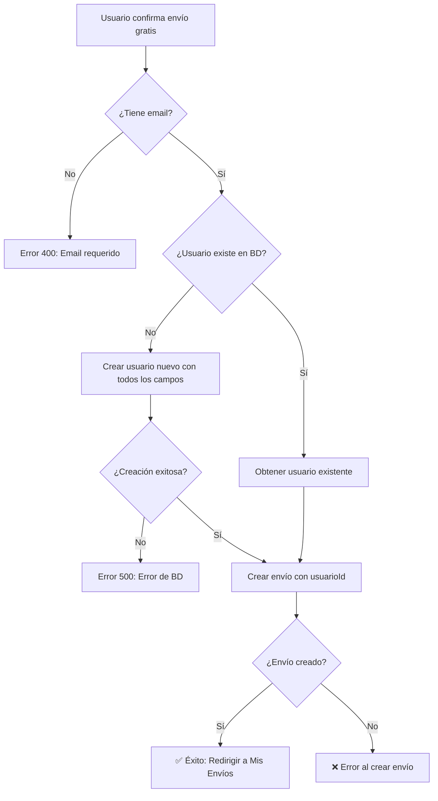

# 🐛 Fix: Error "No se pudo asociar el envío al usuario"

## 📋 Problema Identificado

Al intentar confirmar un envío gratuito, aparecía el error:
```
Error al registrar
No se pudo asociar el envío al usuario
```

## 🔍 Causa Raíz

El endpoint `/api/orders/route.js` intentaba crear automáticamente un usuario nuevo cuando no existía en la base de datos, pero **faltaban campos obligatorios** del modelo `usuarios` en Prisma:

### Campos Faltantes:
- ❌ `updatedAt` - Campo requerido sin valor por defecto
- ❌ `createdAt` - Aunque tiene `@default(now())`, no se especificaba
- ❌ `emailVerified` - Campo booleano requerido
- ❌ `esAdministrador` - Campo booleano requerido
- ❌ `esRecolector` - Campo booleano requerido
- ❌ `failedLogins` - Campo numérico requerido
- ❌ `passwordVersion` - Campo numérico requerido

### Código Problemático (ANTES):
```javascript
usuario = await prisma.usuarios.create({
  data: {
    email: userEmail,
    nombre: body.Remitente?.Nombre || 'Usuario',
    celular: body.Remitente?.Telefono || '0000000000',
    rol: 'cliente', // ❌ Este campo no existe en el schema!
  },
});
```

## ✅ Solución Implementada

### 1. Crear Usuario con Todos los Campos Requeridos

```javascript
if (!usuario) {
  console.log('⚠️ Usuario no encontrado, creando nuevo usuario...');
  const now = new Date();
  usuario = await prisma.usuarios.create({
    data: {
      email: userEmail,
      nombre: body.Remitente?.Nombre || 'Usuario',
      celular: body.Remitente?.Telefono || '0000000000',
      emailVerified: false,           // ✅ Inicializar en false
      esAdministrador: false,          // ✅ Usuario normal
      esRecolector: false,             // ✅ Usuario normal
      failedLogins: 0,                 // ✅ Sin intentos fallidos
      passwordVersion: 0,              // ✅ Versión inicial
      createdAt: now,                  // ✅ Timestamp de creación
      updatedAt: now,                  // ✅ Timestamp de actualización
    },
  });
  console.log('✅ Usuario creado:', usuario.id);
}
```

### 2. Mejorar Manejo de Errores

**Antes:**
```javascript
} catch (error) {
  console.error('❌ Error buscando/creando usuario:', error);
}
```

**Después:**
```javascript
} catch (error) {
  console.error('❌ Error buscando/creando usuario:', error);
  const errorDetails = error instanceof Error ? error.message : String(error);
  return NextResponse.json({
    message: 'Error al buscar o crear usuario en la base de datos',
    details: errorDetails,
    hint: 'Verifica que el email sea válido y que la base de datos esté accesible',
  }, { status: 500 });
}
```

### 3. Validar Email Antes de Continuar

**Antes:**
```javascript
} else {
  console.warn('⚠️ No se proporcionó email de usuario');
}
// Continuaba el código sin verificar
```

**Después:**
```javascript
} else {
  console.warn('⚠️ No se proporcionó email de usuario');
  return NextResponse.json({
    message: 'Email de usuario requerido',
    details: 'No se proporcionó usuarioEmail en la solicitud',
  }, { status: 400 });
}
```

## 🧪 Pruebas

### Escenario 1: Usuario Nuevo (Primera vez)
```javascript
// Usuario NO existe en la BD
// ✅ Se crea automáticamente con todos los campos
// ✅ Se registra el envío exitosamente
```

### Escenario 2: Usuario Existente
```javascript
// Usuario YA existe en la BD
// ✅ Se encuentra el usuario
// ✅ Se registra el envío exitosamente
```

### Escenario 3: Sin Email
```javascript
// No se proporciona usuarioEmail
// ❌ Retorna error 400: "Email de usuario requerido"
```

### Escenario 4: Error de Base de Datos
```javascript
// Error al conectar o consultar BD
// ❌ Retorna error 500 con detalles del problema
```

## 📊 Flujo Corregido



## 🔧 Archivos Modificados

### `src/app/api/orders/route.js`

**Cambios:**
1. ✅ Agregados campos obligatorios al crear usuario
2. ✅ Mejorado manejo de errores con mensajes descriptivos
3. ✅ Validación temprana de email de usuario
4. ✅ Logs más detallados para debugging

**Líneas modificadas:** 68-115

## 🚀 Cómo Probar

### 1. Reiniciar el Servidor
```bash
# Detener: Ctrl + C
# Iniciar:
npm run dev
```

### 2. Probar Envío Gratuito

**Escenario A: Usuario Nuevo**
1. Usa un email que NO exista en la BD
2. Calcula un envío (con test mode activado, costo = $0)
3. Haz clic en "Confirmar Envío Gratis"
4. Verificar: 
   - Consola del navegador muestra: `✅ Usuario creado: X`
   - Consola del navegador muestra: `✅ Envío gratuito creado exitosamente`
   - Redirige a `/misenvios`

**Escenario B: Usuario Existente**
1. Usa el mismo email de una sesión anterior
2. Repite pasos 2-4
3. Verificar:
   - Consola muestra: `✅ Usuario encontrado: X`
   - Resto igual que Escenario A

### 3. Verificar en la Base de Datos

```sql
-- Ver usuarios creados
SELECT id, email, nombre, celular, emailVerified, createdAt 
FROM usuarios 
ORDER BY createdAt DESC 
LIMIT 5;

-- Ver envíos asociados
SELECT he.id, he.NumeroGuia, he.Estado, u.email
FROM historial_envio he
JOIN usuarios u ON he.usuarioId = u.id
ORDER BY he.FechaSolicitud DESC
LIMIT 5;
```

## 📝 Logs Esperados

### Consola del Servidor (Terminal)
```
📧 Email del usuario: usuario@ejemplo.com
⚠️ Usuario no encontrado, creando nuevo usuario...
✅ Usuario creado: 123
📦 Creando envío con usuarioId: 123
✅ Envío creado exitosamente: {
  id: 456,
  NumeroGuia: 'GUIA-20251015-ABCD',
  usuarioId: 123
}
```

### Consola del Navegador (F12)
```
📦 Creando envío gratuito: {...}
✅ Envío gratuito creado exitosamente: {...}
📦 Detalles del envío: {
  id: 456,
  NumeroGuia: 'GUIA-20251015-ABCD',
  usuarioId: 123,
  Estado: 'RECOLECCION_PENDIENTE'
}
🔄 Redirigiendo a Mis Envíos...
```

## ⚠️ Errores Comunes y Soluciones

### Error: "Email de usuario requerido"
**Causa:** No hay sesión activa o el email no se está enviando  
**Solución:** Inicia sesión primero con Google o email

### Error: "Error al buscar o crear usuario en la base de datos"
**Causa:** Problema de conexión con PostgreSQL  
**Solución:** Verifica que DATABASE_URL esté correcto en `.env.local`

### Error: "El número de guía ya existe"
**Causa:** Se está intentando crear un envío con un número de guía duplicado  
**Solución:** Esto no debería pasar (el número incluye timestamp), pero si ocurre, intenta nuevamente

## ✅ Checklist de Verificación

- [x] Campos obligatorios agregados al crear usuario
- [x] Manejo de errores mejorado con mensajes claros
- [x] Validación de email antes de continuar
- [x] Logs detallados para debugging
- [x] Código sin errores de sintaxis
- [x] Documentación completa del fix

## 📚 Referencias

- **Schema de Prisma:** `prisma/schema.prisma` (modelo `usuarios`)
- **Endpoint:** `src/app/api/orders/route.js` (función POST)
- **Componente:** `src/components/Resumen.js` (función `handleFreeShipment`)

---

**Fecha del Fix:** Octubre 15, 2025  
**Commit:** Próximo commit  
**Prioridad:** Alta (bloqueaba funcionalidad de envíos gratis)  
**Estado:** ✅ Resuelto
